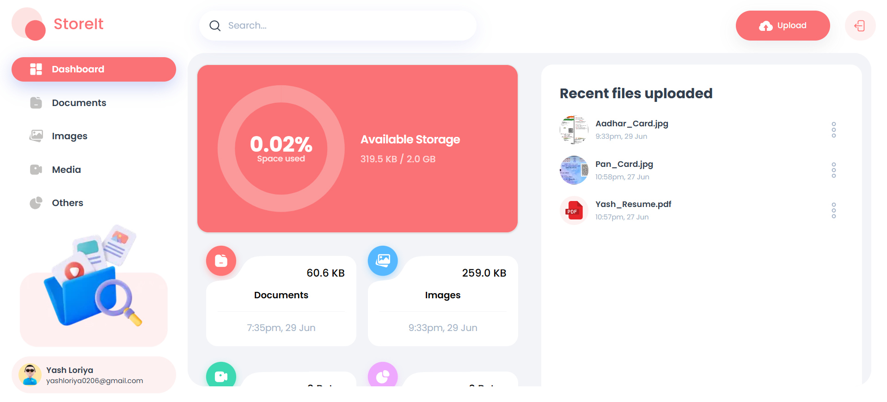
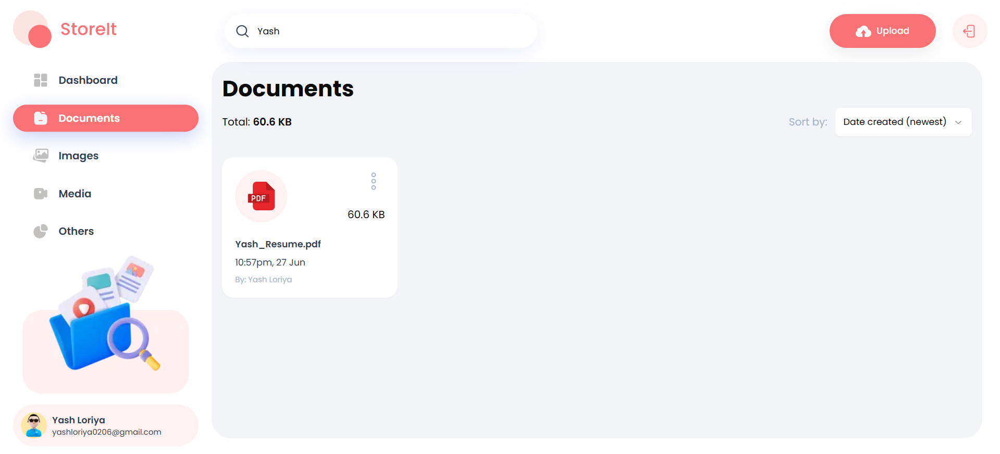
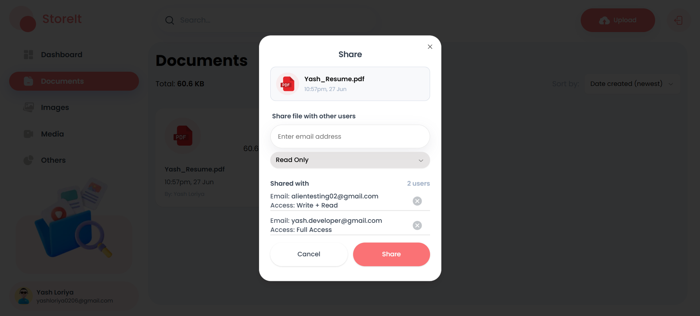

Here’s an updated version of your README with the new features:

---

# 📂 StoreIt – Secure Cloud Storage Manager

A fully responsive, role-based cloud storage management system where users can **securely store, manage, and share files with granular access control**.

---

## Features

* **OTP-Based Authentication**

  * Secure **Signup** and **Login** using email OTP verification.

* **File Upload and Storage**

  * All files are securely saved to **Appwrite Storage**.
  * Metadata and access control info stored in **MongoDB**.

* **Full CRUD Operations on Files**

  * **Upload**, **Rename**, **View Details**, **Download**, and **Delete** files.

* **File Sharing with Role-Based Access Control (RBAC)**

  * Share files with specific users and assign one of the following roles:

    * `r` → **Read Only**
    * `wr` → **Write + Read**
    * `wrs` → **Write + Read + Share**
    * `all` → **Full Access (Write + Read + Delete + Share)**

* **Keyword Generation and Management**

  * **Automatic keyword extraction** from uploaded files using AI (for enhanced search).
  * **Custom keyword addition**: Add your own tags for every file to improve searchability and organization.

* **Link Forwarding**

  * **Forward file links directly** via other apps using the integrated share menu (supports mobile and web sharing APIs).
  * **Copy file links** to clipboard with a single click.

* **Global Search**

  * Search for files across all folders and file types, including via custom and AI-generated keywords.

* **Advanced Sorting Options**

  * Sort files by:

    * **Date Created**
    * **File Size**
    * **Name**
    * **Type**
    * **Last Modified**
    * *(And more...)*

* **Page-Based Filtering by File Type**

  * Easily filter between **Documents**, **Images**, **Media**, and **Others**.

* **Fully Responsive UI**

  * Works seamlessly across **desktop**, **tablet**, and **mobile** devices.

---

## Tech Stack

| Layer          | Technology                                            |
| -------------- | ----------------------------------------------------- |
| Frontend       | **Next.js (App Router)** + **TypeScript**             |
| UI             | **ShadCN UI** + **Tailwind CSS**                      |
| Backend        | **Node.js + Express.js** (for all CRUD and Auth APIs) |
| Database       | **MongoDB** (for secure user and file metadata)       |
| File Storage   | **Appwrite Storage**                                  |
| Authentication | **Custom OTP-based Email Auth**                       |

---

## Setup Instructions

1. **Clone the Repository:**

```bash
git clone https://github.com/YashLoriya02/storage-management.git
cd storage-management
```

2. **Install Dependencies:**

```bash
# Frontend (Next.js)
cd client
npm i

# Backend (Express)
cd ../server
npm i
```

3. **Configure Environment Variables:**

Create `.env.local` for the client and `.env` for the server as shown below.

---

## Environment Variables Setup

### Frontend (`/client/.env.local`):

```env
NEXT_PUBLIC_API_ENDPOINT=http://localhost:5000/api
NEXT_PUBLIC_APPWRITE_ENDPOINT=appwrite-endpoint
NEXT_PUBLIC_APPWRITE_PROJECT=your-appwrite-project-id
NEXT_PUBLIC_APPWRITE_DATABASE=your-appwrite-database-id
NEXT_PUBLIC_APPWRITE_FILES_COLLECTION=your-files-collection-id
NEXT_PUBLIC_APPWRITE_BUCKET=your-appwrite-bucket-id

# Appwrite Server API Key (For server-side requests, expose cautiously)
NEXT_APPWRITE_KEY=your-appwrite-api-key
```

---

### Backend (`/server/.env`):

```env
MONGO_URI=your_mongo_uri
JWT_SECRET=your_jwt_secret_here
EMAIL_FROM=your_email@gmail.com
EMAIL_PASSWORD=your_email_app_password_or_smtp_password
PORT=5000
```

---

4. **Run the Backend:**

```bash
cd server
npm run dev
```

5. **Run the Frontend:**

```bash
cd client
npm run dev
```

---

## Folder Structure (High-level)

```
storage-management/
├── client/   (Next.js + Tailwind + ShadCN UI)
└── server/   (Express + MongoDB)
```

---

## Security Notes

* OTP-based authentication
* File storage security via Appwrite with restricted bucket permissions
* MongoDB for access control and user management
* Role-based sharing to control read/write/delete/share access

---

## 📸 Screenshots






